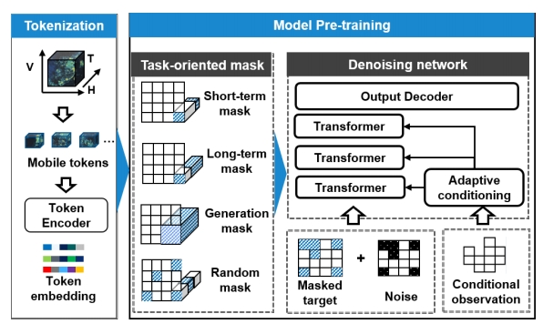
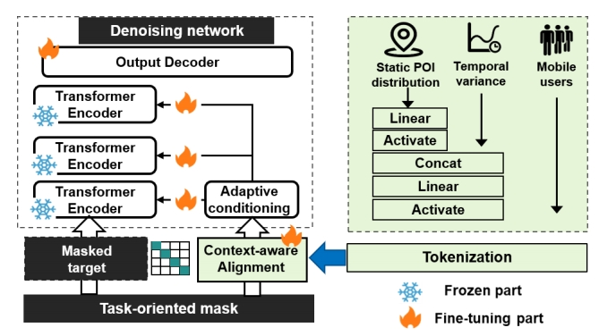

# UoMo: A Universal Model of Mobile Traffic Forecasting for Wireless Network Optimization
This is the official implementation of our foundation model for mobile traffic data, accepted by the KDD 2025 ADS track.

# Overall framework

Our model adopts a three-stage paradigm consisting of <code>tokenization</code>,  <code>pre-training</code> and <code>fine-tuning</code>. The tokenization stage transforms the data into an <code>T, H, W</code> representation. The pre-training stage learns the fundamental features of the data, while the fine-tuning stage incorporates the number of users and the distribution of POIs as conditional inputs.

# Pre-training & Fine-tuning

<figure class="half">

</figure>
