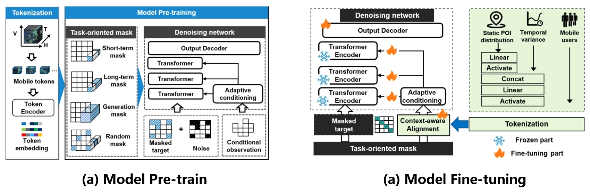

# UoMo: A Universal Model of Mobile Traffic Forecasting for Wireless Network Optimization
This is the official implementation of our foundation model for mobile traffic data, accepted by the KDD 2025 ADS track.


# Overall framework


Our model adopts a three-stage paradigm consisting of <code>tokenization</code>,  <code>pre-training</code> and <code>fine-tuning</code>. The tokenization stage transforms the data into an <code>T, H, W</code> representation. The pre-training stage learns the fundamental features of the data, while the fine-tuning stage incorporates the number of users and the distribution of POIs as conditional inputs.


# Pre-training & Fine-tuning



# Provided Datasets

We provide three datasets used in the original model training: **TrafficNJ**, **TrafficSD**, and **TrafficNC**, along with corresponding **user count** and **POI data**.

## 1. Data Usage

- The datasets are located in the `dataset64time` folder.
- Please extract each `.rar` file to obtain the data in `.json` format.

## 2. Data Format

Each dataset is stored as a dictionary containing the following four keys:

- `train`: shape `N₁ × 1 × 64 × 4 × 4`  
  - `64`: temporal length  
  - `4 × 4`: spatial patches of the geographical area  

- `test`: shape `N₂ × 1 × 64 × 4 × 4`  
  - `64`: temporal length  
  - `4 × 4`: spatial patches of the geographical area  

- `val`: shape `N₃ × 1 × 64 × 4 × 4`  
  - `64`: temporal length  
  - `4 × 4`: spatial patches of the geographical area  

- `timestamp`: shape `N × 1 × 64 × 2`  
  - `64`: temporal length  
  - `2`: timestamp corresponding to each time step, formatted as `[time, day]`

## 3. Dataset Description

- **TrafficNJ**  
  - 15-minute granularity  
  - timestamp dimension space: `[96, 7]`

- **TrafficNC**  
  - 30-minute granularity  
  - timestamp dimension space: `[48, 7]`

- **TrafficSD**  
  - 1-hour granularity  
  - timestamp dimension: `[24, 7]`

# Getting Started

## 1. Environment

- Python >= 3.7  
- PyTorch >= 2.0.0  
- CUDA >= 11.7  

Use the following command to install all required Python modules and packages:

```bash
pip install -r requirements.txt
 ```

## 2. Running the Code

- Extract the `.rar` files in the `dataset64time` folder.

- Run the model using one of the following options:

    - **Run pre-training and fine-tuning together**:

        ```bash
        python run.py
        ```

    - **Run pre-training and fine-tuning separately**:

        - Pre-training:

            ```bash
            python main.py
            ```

        - Fine-tuning:

            ```bash
            python main_alignment.py
            ```

## 3. Pre-trained Models and Generated Data Directory

- The pre-trained models and generated data are saved in the following directory:

    ```
    experiments/Len64_{Dataset_name}_DiT
    ```

## 4. Fine-tuned Models and Generated Data Directory

- The fine-tuned models and generated data are saved in the following directory:

    ```
    experiments/Len64_data_{Dataset_name}_Finetuning
    ```


## 5. Experimental Results

In the original paper, we conducted experiments by mixing multiple city-level datasets as input to UoMo. The resulting performance is shown as follows.


<p align="center">
  
</p>

